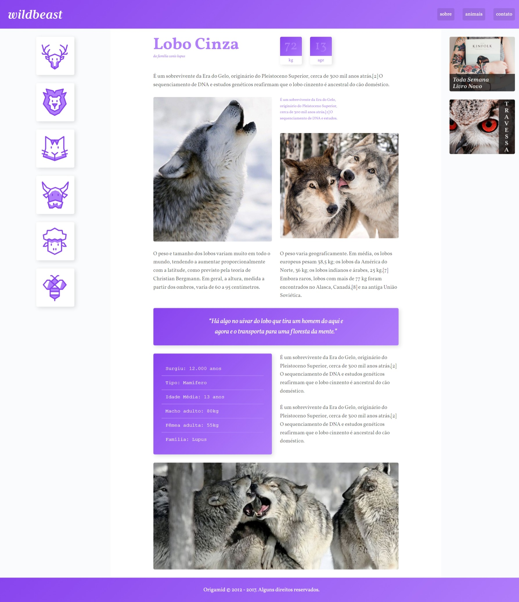

<h1 align= "center"><br>
WILDBEAST<br><br>

</h1>

## 🐺Sobre:

###  Criei um layout responsivo no CSS utilizando apenas as propriedades do Flexbox para treinar.

<br><br>


```bash
#Clone the project
$ git clone https://github.com/LairaCastro/wildbeast.git
```
